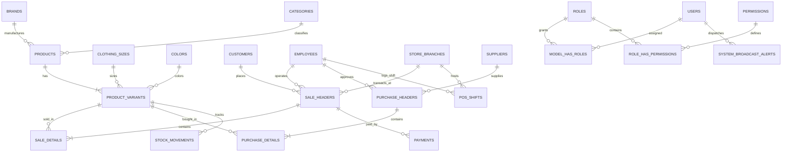

# KhmeRiel MIS & POS — Master API Reference & RBAC Architecture

> **Gateway Domain (Production)**: `https://api.kesararamwithdigital.tech/api/v1`  
> **Gateway Domain (Local)**: `http://127.0.0.1:8000/api/v1`  
> **Database Host**: Neon PostgreSQL (`neondb` on AWS us-east-1)  
> **CDN Media Host**: Cloudinary Edge (`od8t271n`)  
> **Default Tax System**: `10.00% Tax-Exclusive (VAT)`

---

## 1. Global Standard Response Envelopes

### 1.1 Success Response (`200 OK` / `201 Created`)
```json
{
  "success": true,
  "message": "Human readable action summary",
  "data": { ... }
}
```

### 1.2 Error Response Formats

#### A. Validation Error (`422 Unprocessable Entity`)
```json
{
  "success": false,
  "message": "The given data was invalid.",
  "errors": {
    "items.0.quantity": ["The items.0.quantity must be at least 1."],
    "payment_method": ["The selected payment method is invalid."]
  }
}
```

#### B. Unauthorized / Missing Token (`401 Unauthorized`)
```json
{
  "success": false,
  "message": "Unauthenticated or invalid Sanctum bearer token."
}
```

#### C. Forbidden / RBAC Guard Violation (`403 Forbidden`)
```json
{
  "success": false,
  "message": "Unauthorized. You do not have the required role [MANAGER, ADMIN] to perform this action."
}
```

#### D. Resource Not Found (`404 Not Found`)
```json
{
  "success": false,
  "message": "Resource with specified ID does not exist."
}
```

#### E. Business Logic / Insufficient Stock Error (`400 Bad Request`)
```json
{
  "success": false,
  "message": "Insufficient stock for SKU [SILK-M-BLK-019]. Requested: 5, Available: 2."
}
```

---

## 2. Complete Core Endpoints Directory by RBAC Level

### 🌐 LEVEL 1: PUBLIC / GUEST (Storefront & Catalog Showcase)
*No authentication required. High-speed cached reads for customer frontend.*

| Method | Endpoint Path | Query / Body Params | Response Data |
| :--- | :--- | :--- | :--- |
| `GET` | `/health` | None | API uptime, DB ping, Cloudinary CDN connection |
| `GET` | `/status` | None | Brand metadata, logo URL, software version |
| `GET` | `/guide` | None | SalesBinder-style Help Centre Knowledge Base Web UI |
| `GET` | `/docs` | None | Programmatic JSON API Documentation Guide |
| `GET` | `/inventory/statistics` | `?only_in_stock=true` | SalesBinder Total Valuation (Cost vs Resale), Margins & Quantities |
| `GET` | `/settings/audio-cues` | None | POS Scanner wav audio URLs (beep, chime, buzz) |
| `POST`| `/auth/login` | `{"email": "...", "password": "..."}` | Sanctum Bearer Token, User Object, Role Name |
| `GET` | `/categories` | `?department=APPAREL` | List of 9 product categories |
| `GET` | `/categories/{id}` | None | Single category detail |
| `GET` | `/brands` | None | List of 5 verified brands (KhmeRiel, RLX, etc.) |
| `GET` | `/brands/{id}` | None | Single brand detail |
| `GET` | `/clothing-sizes` | None | List of 5 core sizes (`S`, `M`, `L`, `XL`, `OS`) |
| `GET` | `/clothing-sizes/{id}` | None | Single size definition |
| `GET` | `/colors` | None | List of 3 luxury colors (`Black`, `White`, `Gold`) |
| `GET` | `/colors/{id}` | None | Single color hex & swatch metadata |
| `GET` | `/products` | `?category_id=16&brand_id=13` | List of products with primary image & price |
| `GET` | `/products/{id}` | None | Product detail with variants array & images |
| `GET` | `/products/{id}/matrix` | None | 2D Size $\times$ Color stock availability matrix |
| `GET` | `/products/{id}/colorways`| None | Colorway swatches & associated shot gallery |
| `GET` | `/products/{id}/reviews`| None | Customer verified product reviews |
| `POST`| `/products/{id}/reviews`| `{"rating": 5, "comment": "..."}` | Submit new customer review |
| `GET` | `/marketing/banners` | None | Active promotional banners for hero slider |
| `GET` | `/promotions/active` | None | Active discount campaigns & seasonal offers |
| `POST`| `/promotions/verify-coupon` | `{"code": "SUMMER10"}` | Verify coupon validity and discount value |
| `GET` | `/wishlist` | `?customer_id=1` | Fetch customer wishlist items |
| `POST`| `/wishlist/toggle` | `{"customer_id": 1, "product_id": 19}` | Add/remove product from wishlist |

---

### 💳 LEVEL 2: CASHIER & STAFF (POS Register & Showroom Floor)
*Requires `Authorization: Bearer <token>` with role `CASHIER`, `STAFF`, `MANAGER`, or `ADMIN`.*

| Method | Endpoint Path | Role Guard | Key Parameters / Request Body | Purpose |
| :--- | :--- | :---: | :--- | :--- |
| `GET` | `/dashboard/role-pulse` | **ALL ROLES** | None | Returns role-tailored Pie Chart & Agile Velocity Graph |
| `GET` | `/alerts/active` | **ALL ROLES** | None | Real-time broadcast alerts & emergency reminders banner |
| `GET` | `/variants/barcode/{barcode}` | **CASHIER, STAFF** | Path parameter: barcode string | Instant barcode scanner lookup |
| `GET` | `/variants/low-stock` | **STAFF, CASHIER** | `?threshold=10` | List variants below minimum reorder level |
| `GET` | `/variants/{id}` | **STAFF, CASHIER** | None | Variant detail (stock, SKU, barcode, price) |
| `GET` | `/variants/{id}/barcode-label`| **STAFF, CASHIER** | None | Printable SVG/PNG barcode label format |
| `GET` | `/shifts/current` | **CASHIER** | None | Status of active cash drawer shift |
| `POST`| `/shifts/open` | **CASHIER** | `{"opening_float_usd": 100.00}` | Open cash drawer with starting float |
| `POST`| `/shifts/drop-cash` | **CASHIER** | `{"amount_usd": 500.00, "reason": "Midday drop"}` | Mid-shift cash drop to safe |
| `POST`| `/shifts/close` | **CASHIER** | `{"closing_cash_usd": 1845.00, "notes": "..."}` | Close register shift & generate Z-Report |
| `POST`| `/sales/checkout` | **CASHIER** | Items array, customer_id, payment_method, tax_rate | Execute POS sale with atomic stock deduction |
| `GET` | `/sales` | **CASHIER** | `?date=today` | Today's register transactions |
| `GET` | `/sales/{id}` | **CASHIER** | None | Invoice details with 10% VAT breakdown |
| `GET` | `/sales/{id}/invoice-pdf` | **CASHIER** | None | High-res SalesBinder-style A4 Printable Tax Invoice View |
| `GET` | `/invoices` | **CASHIER** | `?status=ESTIMATE` | List Sales Orders, Invoices & Estimates with billing totals |
| `POST`| `/estimates` | **CASHIER** | Items, customer_id, discount, tax_rate | Create formal quotation estimate without deducting stock |
| `POST`| `/estimates/{id}/convert` | **CASHIER** | `{"payment_method": "ABA"}` | 1-Click Convert Estimate to Invoice & deduct stock |
| `GET` | `/sales/{id}/receipt-thermal` | **CASHIER** | None | 80mm ESC/POS thermal receipt format |
| `GET` | `/sales/{id}/khqr` | **CASHIER** | None | Dynamic ABA / Bakong KHQR payment string |
| `GET` | `/customers` | **CASHIER, STAFF** | `?search=012888999` | Search customer directory by phone or name |
| `POST`| `/customers` | **CASHIER** | `{"customer_name": "...", "phone": "..."}` | Fast customer registration at checkout |
| `GET` | `/customers/{id}` | **CASHIER, STAFF** | None | Customer profile, VIP tier & credit balance |
| `GET` | `/customers/{id}/loyalty` | **CASHIER** | None | Customer loyalty points balance & history |
| `POST`| `/customers/{id}/redeem-points` | **CASHIER** | `{"points": 100, "sale_id": 101}` | Redeem points for instant cash discount |
| `POST`| `/gift-cards/check` | **CASHIER** | `{"code": "GIFT-9821"}` | Verify gift card balance |
| `POST`| `/gift-cards/issue` | **CASHIER** | `{"amount": 50.00, "recipient_email": "..."}` | Issue new digital/physical gift card |
| `GET` | `/shipping/orders` | **CASHIER, STAFF** | None | Click-and-collect & local courier deliveries |
| `POST`| `/shipping/create` | **CASHIER** | `{"sale_id": 101, "address": "...", "courier": "..."}` | Dispatch omnichannel delivery order |
| `POST`| `/shipping/{id}/status` | **CASHIER, STAFF** | `{"status": "DELIVERED"}` | Update shipment tracking status |

---

### 👔 LEVEL 3: MANAGER (Catalog, Inventory, Purchasing & Voiding)
*Requires `Authorization: Bearer <token>` with role `MANAGER` or `ADMIN`.*

| Method | Endpoint Path | Permission | Request Body / Details | Purpose |
| :--- | :--- | :--- | :--- | :--- |
| `POST`| `/categories` | `categories.create` | `{"category_name": "...", "department_type": "APPAREL"}` | Add new category |
| `PUT` | `/categories/{id}` | `categories.update` | Category attributes | Update category |
| `DELETE`| `/categories/{id}`| `categories.delete` | None | Delete / Archive category |
| `POST`| `/brands` | `brands.create` | `{"brand_name": "...", "country_of_origin": "..."}` | Add new brand |
| `PUT` | `/brands/{id}` | `brands.update` | Brand attributes | Update brand metadata |
| `DELETE`| `/brands/{id}` | `brands.delete` | None | Delete brand |
| `POST`| `/products` | `products.create` | Product details, material, category_id, brand_id | Create new product |
| `PUT` | `/products/{id}` | `products.update` | Product details | Update product |
| `DELETE`| `/products/{id}`| `products.delete` | None | Archive product |
| `POST`| `/variants` | `variants.create` | SKU, barcode, size_id, color_id, price, cost | Create new variant |
| `PUT` | `/variants/{id}` | `variants.update` | Variant attributes | Update variant pricing/SKU |
| `DELETE`| `/variants/{id}`| `variants.delete` | None | Delete variant |
| `POST`| `/sales/{id}/void` | `sales.void` | `{"reason": "Customer changed mind"}` | Void sale & restore inventory |
| `GET` | `/stock-movements` | `stock-movements.view` | `?variant_id=1` | Audit stock ledger |
| `POST`| `/stock-movements/adjust` | `stock-movements.adjust`| `{"variant_id": 1, "type": "IN", "quantity": 20}` | Manual stock adjustment |
| `GET` | `/suppliers` | `suppliers.view` | None | List all suppliers |
| `POST`| `/suppliers` | `suppliers.create` | `{"supplier_name": "...", "phone": "..."}` | Register new supplier |
| `PUT` | `/suppliers/{id}` | `suppliers.update` | Supplier attributes | Update supplier details |
| `DELETE`| `/suppliers/{id}`| `suppliers.delete` | None | Delete supplier |
| `GET` | `/purchases` | `purchases.view` | None | List purchase orders |
| `POST`| `/purchases` | `purchases.create` | `{"supplier_id": 1, "items": [...]}` | Create purchase order |
| `GET` | `/purchases/{id}` | `purchases.view` | None | View PO breakdown |
| `GET` | `/inventory/restock-recommendations`| `purchases.view` | None | AI/Run-rate restock forecasting |
| `POST`| `/purchases/auto-generate`| `purchases.create` | None | Auto-generate purchase orders |
| `GET` | `/uploads/gallery` | `uploads.view` | None | Cloudinary asset media browser |
| `POST`| `/uploads/image` | `uploads.create` | Multipart file upload | Upload image to Cloudinary CDN |
| `POST`| `/uploads/batch` | `uploads.create` | Array of images | Batch upload photoshoot images |
| `DELETE`| `/uploads/image`| `uploads.delete` | `{"public_id": "SILK_SHIRT"}` | Delete image from Cloudinary |
| `POST`| `/marketing/banners` | `marketing.create` | Banner image URL, title, link | Add storefront banner |
| `DELETE`| `/marketing/banners/{id}`| `marketing.delete` | None | Delete banner |

---

### 👑 LEVEL 4: ADMIN (Master Command, Staff Timesheets, Security & Broadcast)
*Requires `Authorization: Bearer <token>` with role `ADMIN` only.*

| Method | Endpoint Path | Permission | Purpose & Details |
| :--- | :--- | :--- | :--- |
| `GET` | `/admin/master-pulse` | `admin.master` | **Admin Command Console**: Staff working hours & efficiency, Financial Waterfall flow ($), Agile sprint velocity, Size $\times$ Color matrix coverage tracker. |
| `POST`| `/admin/broadcast-alert`| `admin.broadcast` | **Global Message Broadcast**: Send urgent alerts, reminders, or flash notices to all users or specific roles (`ALL`, `CASHIER`, `STAFF`, `MANAGER`). |
| `GET` | `/employees` | `employees.view` | List all employee records, salary/position, assigned store branch |
| `POST`| `/employees` | `employees.create` | Create new staff profile |
| `PUT` | `/employees/{id}` | `employees.update` | Edit employee profile, status or contact |
| `DELETE`| `/employees/{id}` | `employees.delete` | Deactivate / archive employee profile |
| `POST`| `/auth/register` | `users.create` | Create new portal user login & assign Spatie RBAC Role |
| `GET` | `/audit-logs` | `audit-logs.view` | Immutable system audit log trail (every price edit, void, stock change) |
| `GET` | `/audit-logs/{id}` | `audit-logs.view` | Single audit record inspection with IP, payload diff, and timestamp |

---

## 3. Database Architecture & Relationships



---

## 4. Financial & Tax Calculation Logic

### 4.1 10% Tax-Exclusive Formula
$$\text{Net Amount} = \text{Total Amount} - \text{Overall Discount}$$
$$\text{Tax Amount (10\% VAT)} = \text{Round}\left(\text{Net Amount} \times 0.10, 2\right)$$
$$\text{Grand Total Payable} = \text{Net Amount} + \text{Tax Amount}$$

### 4.2 Historical Price Preservation Rule
The unit price on `sale_details` is permanently stamped at the moment of checkout from `product_variants.sale_price`. Future price edits in catalog never alter historical receipts or tax reporting.
