# SS-MIS Database Schema & Entity-Relationship (ER) Diagram (Standard Enterprise SQL)

Authoritative reference for the database tables, data types, constraints, and relationships for the Store Stock & Point-of-Sale Information System (SS-MIS).

Designed according to **worldwide enterprise SQL standards**, incorporating:
- Standard ANSI SQL types (`DECIMAL(12,2)`, `BIGINT`, `VARCHAR`, `TIMESTAMPTZ`, `BOOLEAN`).
- Financial accuracy for POS transactions using exact fixed-point decimal arithmetic.
- Soft delete support (`deleted_at`) for audit compliance and historical integrity.
- Multi-store / multi-branch readiness (`store_id`).
- Barcode / EAN scanner integration (`barcode`).
- Comprehensive audit timestamps (`created_at`, `updated_at`, `deleted_at`).
- Detailed stock movements with pre/post balance audit trail (`stock_before`, `stock_after`).

## Entity-Relationship Diagram (Mermaid)

```mermaid
erDiagram

    STORE_BRANCH ||--o{ STORE_INVENTORY : holds
    STORE_BRANCH ||--o{ EMPLOYEE : employs
    
    BRAND ||--o{ PRODUCT : manufactures
    CATEGORY ||--o{ CATEGORY : parent_child
    CATEGORY ||--o{ PRODUCT : categorizes
    PRODUCT ||--o{ PRODUCT_VARIANT : has
    PRODUCT ||--o{ PRODUCT_IMAGE : gallery
    PRODUCT ||--o{ PRODUCT_REVIEW : receives
    PRODUCT ||--o{ CUSTOMER_WISHLIST : saved_in
    PRODUCT_VARIANT ||--o{ PRODUCT_IMAGE : variant_image
    PRODUCT_VARIANT ||--o{ PRODUCT_BATCH : tracks_lot
    PRODUCT_VARIANT ||--o{ STORE_INVENTORY : stocked_at
    PRODUCT_VARIANT ||--o{ BUNDLE_ITEM : component_of
    PRODUCT_BUNDLE ||--|{ BUNDLE_ITEM : includes
    CLOTHING_SIZE ||--o{ PRODUCT_VARIANT : sizes
    COLOR ||--o{ PRODUCT_VARIANT : colors

    PROMOTION ||--o{ SALE_HEADER : discounts

    SUPPLIER ||--o{ PURCHASE_HEADER : supplies
    EMPLOYEE ||--o{ PURCHASE_HEADER : creates
    PURCHASE_HEADER ||--|{ PURCHASE_DETAIL : contains
    PRODUCT_VARIANT ||--o{ PURCHASE_DETAIL : purchased

    CUSTOMER ||--o{ SALE_HEADER : places
    CUSTOMER ||--o{ PRODUCT_REVIEW : writes
    CUSTOMER ||--o{ CUSTOMER_WISHLIST : maintains
    EMPLOYEE ||--o{ SALE_HEADER : processes
    SALE_HEADER ||--|{ SALE_DETAIL : contains
    PRODUCT_VARIANT ||--o{ SALE_DETAIL : sold

    SALE_HEADER ||--o{ PAYMENT : settles

    PRODUCT_VARIANT ||--o{ STOCK_MOVEMENT : tracks


    STORE {
        BIGINT store_id PK
        VARCHAR store_name
        VARCHAR code UK
        VARCHAR tax_id
        VARCHAR phone
        VARCHAR email
        TEXT address
        BOOLEAN is_active
        TIMESTAMP created_at
        TIMESTAMP updated_at
    }

    CATEGORY {
        BIGINT category_id PK
        BIGINT parent_id FK
        VARCHAR category_name UK
        VARCHAR slug UK
        VARCHAR department_type
        TEXT description
        VARCHAR image_url
        BOOLEAN is_active
        TIMESTAMP created_at
        TIMESTAMP updated_at
        TIMESTAMP deleted_at
    }

    PRODUCT {
        BIGINT product_id PK
        BIGINT category_id FK
        VARCHAR product_type
        VARCHAR product_name
        VARCHAR brand
        VARCHAR gender
        VARCHAR material_fabric
        VARCHAR season_collection
        VARCHAR author_artist
        VARCHAR isbn_code
        VARCHAR featured_badge
        TEXT description
        VARCHAR image_url
        VARCHAR image_public_id
        VARCHAR status
        TIMESTAMP created_at
        TIMESTAMP updated_at
        TIMESTAMP deleted_at
    }

    CLOTHING_SIZE {
        BIGINT size_id PK
        VARCHAR size_code UK
        VARCHAR size_name
        TEXT description
    }

    COLOR {
        BIGINT color_id PK
        VARCHAR color_code UK
        VARCHAR color_name
        VARCHAR hex_code
    }

    PRODUCT_VARIANT {
        BIGINT variant_id PK
        BIGINT product_id FK
        BIGINT size_id FK
        BIGINT color_id FK
        VARCHAR unit_of_measure
        VARCHAR volume_or_weight
        DECIMAL alcohol_by_volume
        VARCHAR download_file_url
        VARCHAR sku UK
        VARCHAR barcode UK
        VARCHAR image_url
        VARCHAR image_public_id
        DECIMAL cost_price
        DECIMAL sale_price
        DECIMAL wholesale_price
        INT quantity
        INT reorder_level
        BOOLEAN is_active
        TIMESTAMP created_at
        TIMESTAMP updated_at
        TIMESTAMP deleted_at
    }

    PRODUCT_IMAGE {
        BIGINT image_id PK
        BIGINT product_id FK
        BIGINT variant_id FK
        VARCHAR image_url
        VARCHAR image_public_id
        VARCHAR shot_type
        VARCHAR alt_text
        INT sort_order
        BOOLEAN is_primary
        TIMESTAMP created_at
        TIMESTAMP updated_at
    }

    PRODUCT_BATCH {
        BIGINT batch_id PK
        BIGINT variant_id FK
        VARCHAR batch_number
        DATE manufacturing_date
        DATE expiry_date
        INT quantity_received
        INT quantity_remaining
        VARCHAR status
        TIMESTAMP created_at
        TIMESTAMP updated_at
    }

    SUPPLIER {
        BIGINT supplier_id PK
        VARCHAR supplier_name
        VARCHAR contact_name
        VARCHAR phone
        VARCHAR email
        TEXT address
        VARCHAR tax_id
        VARCHAR status
        TIMESTAMP created_at
        TIMESTAMP updated_at
        TIMESTAMP deleted_at
    }

    EMPLOYEE {
        BIGINT employee_id PK
        BIGINT store_id FK
        VARCHAR employee_name
        VARCHAR gender
        VARCHAR phone
        VARCHAR email
        VARCHAR position
        VARCHAR username UK
        VARCHAR password_hash
        VARCHAR status
        TIMESTAMP created_at
        TIMESTAMP updated_at
        TIMESTAMP deleted_at
    }

    CUSTOMER {
        BIGINT customer_id PK
        VARCHAR customer_name
        VARCHAR gender
        VARCHAR phone UK
        VARCHAR email
        TEXT address
        INT loyalty_points
        TIMESTAMP created_at
        TIMESTAMP updated_at
        TIMESTAMP deleted_at
    }

    PURCHASE_HEADER {
        BIGINT purchase_id PK
        VARCHAR reference_no UK
        BIGINT supplier_id FK
        BIGINT employee_id FK
        BIGINT store_id FK
        TIMESTAMP purchase_date
        DECIMAL total_amount
        DECIMAL tax_amount
        DECIMAL grand_total
        VARCHAR status
        TEXT notes
        TIMESTAMP created_at
        TIMESTAMP updated_at
    }

    PURCHASE_DETAIL {
        BIGINT purchase_detail_id PK
        BIGINT purchase_id FK
        BIGINT variant_id FK
        INT quantity
        DECIMAL unit_cost
        DECIMAL sub_total
    }

    SALE_HEADER {
        BIGINT sale_id PK
        VARCHAR invoice_no UK
        BIGINT store_id FK
        BIGINT customer_id FK
        BIGINT employee_id FK
        TIMESTAMP sale_date
        DECIMAL sub_total
        DECIMAL discount_amount
        DECIMAL tax_amount
        DECIMAL grand_total
        VARCHAR payment_status
        VARCHAR status
        TEXT notes
        TIMESTAMP created_at
        TIMESTAMP updated_at
    }

    SALE_DETAIL {
        BIGINT sale_detail_id PK
        BIGINT sale_id FK
        BIGINT variant_id FK
        INT quantity
        DECIMAL unit_price
        DECIMAL discount_amount
        DECIMAL sub_total
    }

    PAYMENT {
        BIGINT payment_id PK
        BIGINT sale_id FK
        TIMESTAMP payment_date
        DECIMAL amount
        DECIMAL amount_tendered
        DECIMAL change_due
        VARCHAR payment_method
        VARCHAR payment_status
        VARCHAR transaction_ref
        TIMESTAMP created_at
    }

    STOCK_MOVEMENT {
        BIGINT movement_id PK
        BIGINT store_id FK
        BIGINT variant_id FK
        VARCHAR movement_type
        INT quantity
        INT stock_before
        INT stock_after
        TIMESTAMP movement_date
        VARCHAR reference_type
        BIGINT reference_id
        TEXT note
        BIGINT created_by FK
        TIMESTAMP created_at
    }

    BRAND {
        BIGINT brand_id PK
        VARCHAR brand_name UK
        VARCHAR slug UK
        VARCHAR logo_url
        VARCHAR banner_url
        VARCHAR country_of_origin
        TEXT description
        VARCHAR website_url
        BOOLEAN is_featured
        TIMESTAMP created_at
        TIMESTAMP updated_at
    }

    STORE_BRANCH {
        BIGINT branch_id PK
        VARCHAR branch_name
        VARCHAR branch_code UK
        VARCHAR phone
        VARCHAR email
        TEXT address
        VARCHAR city
        BOOLEAN is_warehouse
        BOOLEAN is_active
        TIMESTAMP created_at
        TIMESTAMP updated_at
    }

    STORE_INVENTORY {
        BIGINT inventory_id PK
        BIGINT branch_id FK
        BIGINT variant_id FK
        INT quantity
        INT reorder_level
        TIMESTAMP created_at
        TIMESTAMP updated_at
    }

    PROMOTION {
        BIGINT promotion_id PK
        VARCHAR title
        VARCHAR promo_code UK
        VARCHAR discount_type
        DECIMAL discount_value
        DECIMAL min_spend
        VARCHAR target_department
        TIMESTAMP start_date
        TIMESTAMP end_date
        INT max_usage_count
        INT used_count
        BOOLEAN is_active
        TIMESTAMP created_at
        TIMESTAMP updated_at
    }

    PRODUCT_BUNDLE {
        BIGINT bundle_id PK
        VARCHAR bundle_name
        VARCHAR sku UK
        VARCHAR barcode UK
        DECIMAL bundle_price
        DECIMAL original_total_price
        TEXT description
        VARCHAR image_url
        BOOLEAN is_active
        TIMESTAMP created_at
        TIMESTAMP updated_at
    }

    BUNDLE_ITEM {
        BIGINT bundle_item_id PK
        BIGINT bundle_id FK
        BIGINT variant_id FK
        INT quantity
        TIMESTAMP created_at
        TIMESTAMP updated_at
    }

    PRODUCT_REVIEW {
        BIGINT review_id PK
        BIGINT product_id FK
        BIGINT customer_id FK
        VARCHAR reviewer_name
        INT rating
        VARCHAR title
        TEXT comment
        BOOLEAN is_verified_purchase
        BOOLEAN is_approved
        TIMESTAMP created_at
        TIMESTAMP updated_at
    }

    CUSTOMER_WISHLIST {
        BIGINT wishlist_id PK
        BIGINT customer_id FK
        BIGINT product_id FK
        BIGINT variant_id FK
        TIMESTAMP created_at
        TIMESTAMP updated_at
    }

    MARKETING_BANNER {
        BIGINT banner_id PK
        VARCHAR title
        VARCHAR subtitle
        VARCHAR image_url
        VARCHAR image_public_id
        VARCHAR link_url
        VARCHAR placement
        VARCHAR target_department
        INT sort_order
        BOOLEAN is_active
        TIMESTAMP created_at
        TIMESTAMP updated_at
    }
```

