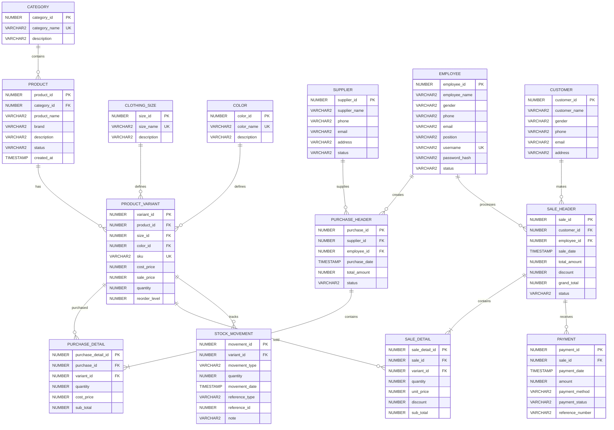

# SS-MIS Database Schema & Entity-Relationship (ER) Diagram

Authoritative reference for the database tables, fields, constraints, and relationships for the Store Stock & Point-of-Sale Information System (SS-MIS).

## Entity-Relationship Diagram

## Entities Summary

1. **CATEGORY**: Product category classification (`category_id`, `category_name`, `description`).
2. **PRODUCT**: Base product catalog (`product_id`, `category_id`, `product_name`, `brand`, `description`, `status`, `created_at`).
3. **CLOTHING_SIZE**: Size master data (`size_id`, `size_name`, `description`).
4. **COLOR**: Color master data (`color_id`, `color_name`, `description`).
5. **PRODUCT_VARIANT**: Specific product SKU variant (`variant_id`, `product_id`, `size_id`, `color_id`, `sku`, `cost_price`, `sale_price`, `quantity`, `reorder_level`).
6. **SUPPLIER**: Supplier directory (`supplier_id`, `supplier_name`, `phone`, `email`, `address`, `status`).
7. **EMPLOYEE**: Employee & system user directory (`employee_id`, `employee_name`, `gender`, `phone`, `email`, `position`, `username`, `password_hash`, `status`).
8. **CUSTOMER**: Customer directory (`customer_id`, `customer_name`, `gender`, `phone`, `email`, `address`).
9. **PURCHASE_HEADER**: Supplier purchase orders (`purchase_id`, `supplier_id`, `employee_id`, `purchase_date`, `total_amount`, `status`).
10. **PURCHASE_DETAIL**: Items inside purchase order (`purchase_detail_id`, `purchase_id`, `variant_id`, `quantity`, `cost_price`, `sub_total`).
11. **SALE_HEADER**: POS sale transactions (`sale_id`, `customer_id`, `employee_id`, `sale_date`, `total_amount`, `discount`, `grand_total`, `status`).
12. **SALE_DETAIL**: Line items in sale transaction (`sale_detail_id`, `sale_id`, `variant_id`, `quantity`, `unit_price`, `discount`, `sub_total`).
13. **PAYMENT**: Payment transaction details (`payment_id`, `sale_id`, `payment_date`, `amount`, `payment_method`, `payment_status`, `reference_number`).
14. **STOCK_MOVEMENT**: Inventory audit log (`movement_id`, `variant_id`, `movement_type`, `quantity`, `movement_date`, `reference_type`, `reference_id`, `note`).
