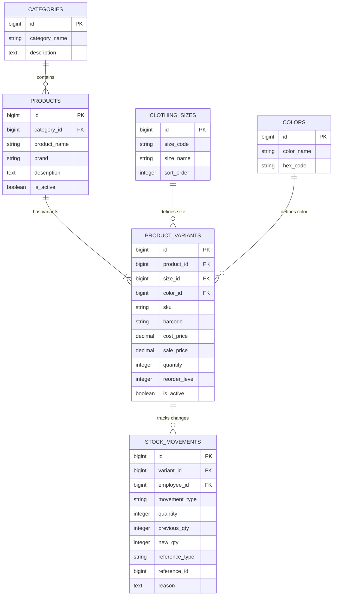
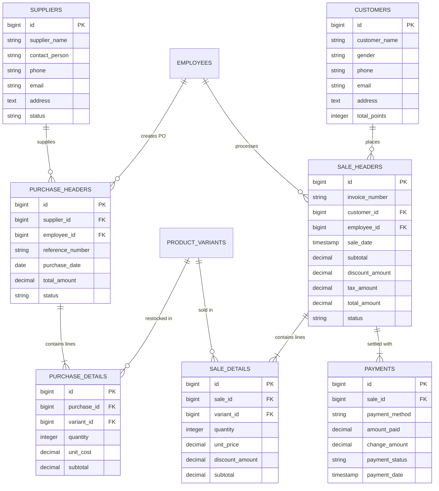
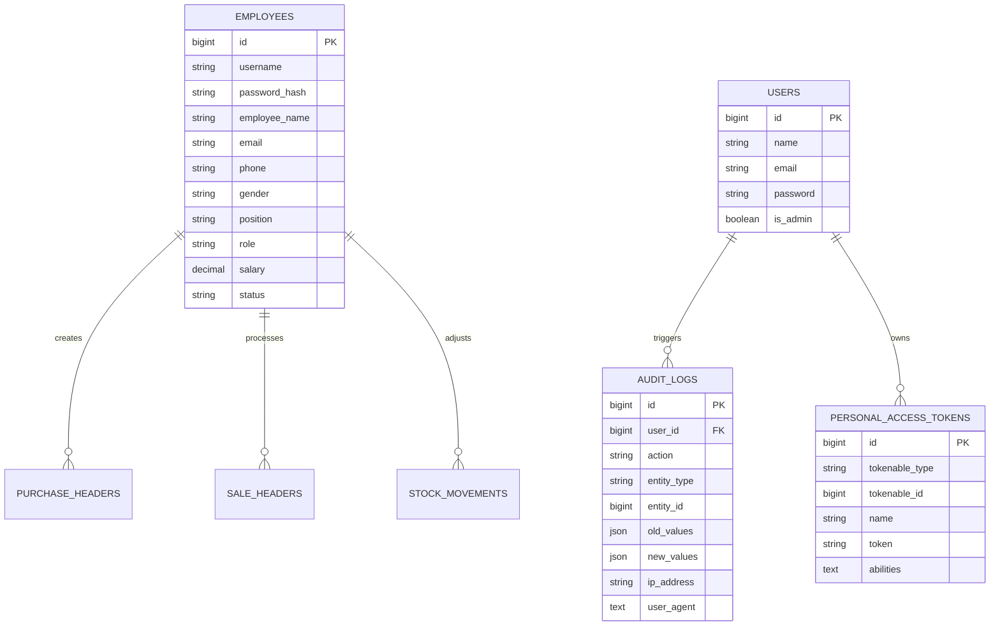

# Store Stock and Point-of-Sale MIS API

RESTful API backend for retail clothing store inventory, supplier purchasing, and point-of-sale operations.

---

## Tech Stack

- Backend: Laravel 11 / PHP 8.3
- Database: PostgreSQL (Neon DB / Local PostgreSQL)
- Authentication: Laravel Sanctum Bearer Tokens
- Deployment: Serverless Gateway (Vercel)

---

## Database Architecture

### 1. Catalog and Inventory Domain


### 2. Point-of-Sale and Purchasing Domain


### 3. Administration and Audit Domain


---

## Role-Based Access Control

| Role | Access Level | Description |
|---|---|---|
| Public / Guest | Level 1 | Read-only catalog, sizes, colors, and stock lookup |
| Cashier | Level 2 | POS checkout, customer management, invoice viewing |
| Manager | Level 3 | Catalog CRUD, suppliers, purchase orders, stock adjustment, dashboard |
| Admin | Level 4 | Employee administration, developer accounts, audit logs |

---

## Core Endpoints

### Public (Level 0 and 1)
- GET / - API route index
- GET /api/v1/health - System and database status
- POST /api/v1/auth/login - User authentication
- GET /api/v1/categories - List product categories
- GET /api/v1/products - List products with variant info
- GET /api/v1/variants - List inventory variants
- GET /api/v1/variants/barcode/{barcode} - Scan barcode lookup

### Cashier (Level 2)
- GET /api/v1/auth/me - Authenticated user profile
- POST /api/v1/auth/logout - Invalidate current token
- GET /api/v1/customers - Search customer records
- POST /api/v1/customers - Register new customer
- POST /api/v1/sales/checkout - Process sale transaction
- GET /api/v1/sales - List sales receipts

### Manager (Level 3)
- GET /api/v1/dashboard/stats - Sales and request metrics
- POST, PUT, DELETE /api/v1/products - Manage products
- POST, PUT, DELETE /api/v1/variants - Manage SKU variants
- POST, PUT, DELETE /api/v1/categories - Manage categories
- GET, POST, PUT /api/v1/suppliers - Manage suppliers
- GET, POST /api/v1/purchases - Purchase orders and restock
- GET, POST /api/v1/stock-movements - Inventory tracking and manual adjustment
- POST /api/v1/sales/{id}/void - Void sale transaction

### Admin (Level 4)
- GET, POST, PUT, DELETE /api/v1/employees - Manage employee accounts
- POST /api/v1/auth/register - Register developer access

---

## Error Response Format

All error responses follow standard REST API schema with Khmer localization text:

```json
{
  "message": "Custom message in Khmer",
  "status": "401"
}
```

Common status codes:
- 401: Unauthorized (missing or invalid Bearer token)
- 403: Forbidden (insufficient role permissions)
- 404: Not Found (resource does not exist)
- 422: Unprocessable Content (validation failure)
- 429: Too Many Requests (rate limit exceeded)
- 500: Internal Server Error

---

## Installation and Local Setup

1. Clone repository and install dependencies:
```bash
composer install
```

2. Copy environment file and generate application key:
```bash
cp .env.example .env
php artisan key:generate
```

3. Configure database settings in .env:
```env
DB_CONNECTION=pgsql
DB_HOST=127.0.0.1
DB_PORT=5432
DB_DATABASE=ssmis_db
DB_USERNAME=postgres
DB_PASSWORD=your_password
```

4. Run migrations and seed default data:
```bash
php artisan migrate --seed
```

5. Start local development server:
```bash
php artisan serve
```
