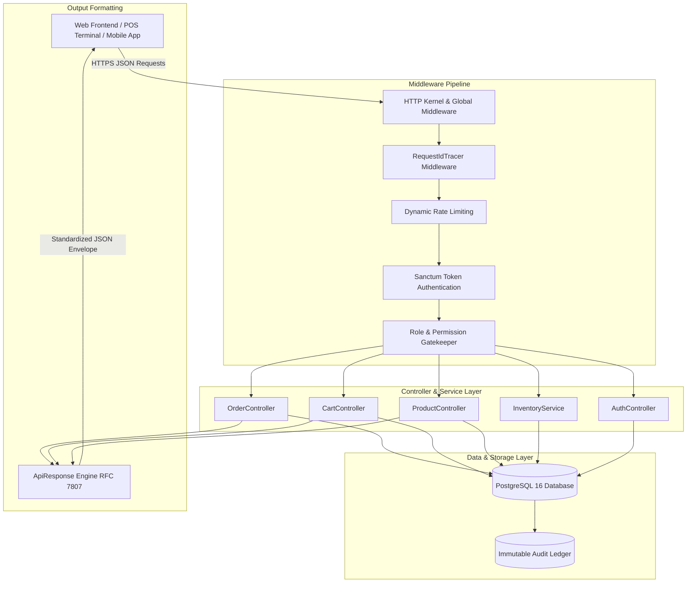
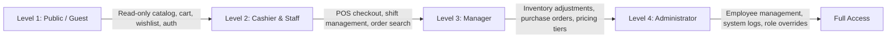

# OutfitShop API


**Version:** 1.0.0  
**Status:** Online  
**Organization:** SNPCodeLab  

Enterprise ecommerce clothing backend API built with Laravel.

---

## Table of Contents

1. [Overview](#1-overview)
2. [Key Features](#2-key-features)
3. [Architecture](#3-architecture)
4. [Requirements](#4-requirements)
5. [Installation](#5-installation)
6. [Environment Variables](#6-environment-variables)
7. [API Documentation](#7-api-documentation)
8. [Response Standards](#8-response-standards)
9. [Authentication](#9-authentication)
10. [Testing](#10-testing)
11. [Deployment](#11-deployment)
12. [Security](#12-security)
13. [Performance](#13-performance)
14. [Monitoring](#14-monitoring)
15. [Contributing](#15-contributing)
16. [License](#16-license)
17. [Support](#17-support)
18. [Acknowledgments](#18-acknowledgments)

---

## 1. Overview

OutfitShop API is an enterprise-grade ecommerce clothing backend platform built with Laravel 11. It provides a robust, scalable RESTful API for managing omnichannel product catalogs, shopping carts, customer wishlists, order processing, inventory tracking, branch store operations, and financial auditing for fashion retail targeting women and men.

The platform is designed to serve the Cambodian retail market with multi-currency (USD / KHR), 10% tax-exclusive calculation engines, and localized branch logistics, while providing full capability for global ecommerce expansion.

---

## 2. Key Features

- **Product Catalog Management**: Comprehensive apparel hierarchies with categories, brands, variants, clothing sizes, colors, and media galleries.
- **Category & Variant System**: Granular SKU tracking across multi-dimensional attributes (size, color, material, fit).
- **Shopping Cart & Wishlist**: Persistent database-driven shopping cart lifecycles and customer wishlist management.
- **Order Processing & Checkout**: Idempotent transactional checkout engine with pessimistic row-locking (`SELECT ... FOR UPDATE`), automated inventory deduction, and payment capture.
- **Inventory & Stock Tracking**: Real-time 4-tier quantity lifecycle (On Hand, Reserved, Available, Incoming) with immutable stock audit ledgers.
- **Supplier & Purchasing Operations**: Complete purchase orders (PO), supplier directories, and goods receiving vouchers.
- **Secure Authentication**: Token-based authentication powered by Laravel Sanctum with strict 4-Tier Role-Based Access Control (`ADMIN`, `MANAGER`, `CASHIER`, `STAFF`).
- **Dashboard & Financial Intelligence**: Real-time asset valuation formulas (Purchased Cost Value vs. Resale Retail Value), gross margin analytics, and POS shift reconciliation.
- **Audit Logging & Tracing**: Distributed request tracing (`request_id` UUID header) across all operational flows and database mutations.

---

## 3. Architecture

OutfitShop API follows a modular three-tier service architecture designed for high throughput, data integrity, and strict separation of concerns:



### 4-Tier RBAC Access Hierarchy



---

## 4. Requirements

- **PHP**: >= 8.2 (PHP 8.3 recommended)
- **Database**: PostgreSQL >= 15 or MySQL >= 8.0
- **Extensions**: `pdo_pgsql` / `pdo_mysql`, `openssl`, `mbstring`, `tokenizer`, `xml`, `ctype`, `json`, `bcmath`, `curl`
- **Dependency Manager**: Composer >= 2.6
- **Node.js / NPM** (optional, for asset compilation): Node >= 18.x

---

## 5. Installation

### 1. Clone the Repository

```bash
git clone https://github.com/SNPCodeLab/outfit-shop-api.git
cd outfit-shop-api
```

### 2. Install PHP Dependencies

```bash
composer install --optimize-autoloader --no-dev
```

### 3. Configure Environment

```bash
cp .env.example .env
php artisan key:generate
```

### 4. Run Migrations & Seeders

```bash
php artisan migrate --force
php artisan db:seed
```

### 5. Start Local Development Server

```bash
php artisan serve --port=8000
```

---

## 6. Environment Variables

| Variable | Default Value | Description |
| :--- | :--- | :--- |
| `APP_NAME` | `OutfitShop API` | Application identifier |
| `APP_ENV` | `production` / `local` | Application runtime environment |
| `APP_KEY` | *(Generated base64 key)* | Encryption key for sessions and tokens |
| `APP_DEBUG` | `false` | Enable/disable detailed debug traces |
| `APP_URL` | `https://api.kesararamwithdigital.tech` | Base URL for API and asset routing |
| `DB_CONNECTION` | `pgsql` | Primary database driver (`pgsql` or `mysql`) |
| `DB_HOST` | `127.0.0.1` | Database host server |
| `DB_PORT` | `5432` | Database port |
| `DB_DATABASE` | `ss_mis` | Database name |
| `DB_USERNAME` | `postgres` | Database username |
| `DB_PASSWORD` | `secret` | Database password |
| `SANCTUM_STATEFUL_DOMAINS` | `app.kesararamwithdigital.tech` | Stateful domains for SPA authentication |

---

## 7. API Documentation

### Public Catalog Endpoints (Level 1: Public / Guest)

| Method | Endpoint | Description |
| :--- | :--- | :--- |
| `GET` | `/` | Root API discovery gateway |
| `GET` | `/api/v1/health` | Service health status check |
| `GET` | `/api/v1/status` | System version and database connectivity probe |
| `GET` | `/api/v1/products` | Browse product catalog with pagination and filters |
| `GET` | `/api/v1/products/{id}` | Retrieve individual product details and variants |
| `GET` | `/api/v1/categories` | List product categories |
| `GET` | `/api/v1/brands` | List apparel brands |
| `GET` | `/api/v1/clothing-sizes` | List clothing sizes (XS, S, M, L, XL, XXL, etc.) |
| `GET` | `/api/v1/colors` | List product colors and hex codes |
| `GET` | `/api/v1/cart` | Retrieve current shopping cart and items |
| `POST` | `/api/v1/cart/items` | Add product variant to shopping cart |
| `PUT` | `/api/v1/cart/items/{id}` | Update item quantity in cart |
| `DELETE` | `/api/v1/cart/items/{id}` | Remove specific item from cart |
| `DELETE` | `/api/v1/cart/clear` | Empty all items in shopping cart |
| `GET` | `/api/v1/wishlist` | Retrieve customer wishlist |
| `POST` | `/api/v1/wishlist/toggle` | Add or remove product from wishlist |

### Authentication Endpoints

| Method | Endpoint | Description |
| :--- | :--- | :--- |
| `POST` | `/api/v1/auth/login` | Authenticate employee and obtain Sanctum Bearer token |
| `GET` | `/api/v1/auth/me` | Fetch authenticated employee profile and permissions |
| `POST` | `/api/v1/auth/logout` | Revoke active token and destroy session |
| `POST` | `/api/v1/auth/refresh` | Refresh personal access token |

### Orders & POS Checkout (Level 2: Cashier & Staff)

| Method | Endpoint | Description |
| :--- | :--- | :--- |
| `GET` | `/api/v1/orders` | List order transactions with date and customer filters |
| `POST` | `/api/v1/orders/checkout` | Idempotent transactional checkout with stock decrement |
| `GET` | `/api/v1/orders/{id}` | Retrieve order details and receipt line items |
| `POST` | `/api/v1/orders/{id}/void` | Void order and reverse inventory allocations |
| `GET` | `/api/v1/sales/*` | Legacy backward-compatibility aliases to Order endpoints |

---

## 8. Response Standards

All API responses strictly adhere to uniform JSON envelopes.

### Success Response (`200 OK` / `201 Created`)

```json
{
  "success": true,
  "status_code": 200,
  "request_id": "e4a7df35-d570-46fa-ba35-e85929fe4973",
  "timestamp": "2026-08-18T15:23:17.694651Z",
  "message": "Products catalog retrieved",
  "data": [
    {
      "id": 1,
      "product_code": "PROD-001",
      "name": "Classic Oxford Cotton Shirt",
      "retail_price": "45.00",
      "category": "Shirts",
      "variants_count": 4
    }
  ],
  "meta": {
    "system": "OutfitShop Ecommerce Clothing API",
    "api_version": "1.0.0",
    "processing_time_ms": 12,
    "pagination": {
      "total": 1,
      "count": 1,
      "per_page": 15,
      "current_page": 1,
      "total_pages": 1
    }
  }
}
```

### Error Response (RFC 7807 Problem Details)

```json
{
  "success": false,
  "status_code": 422,
  "request_id": "93b1d723-5ec9-4672-885e-63f572a1be42",
  "timestamp": "2026-08-18T15:24:02.102341Z",
  "error": {
    "code": "VALIDATION_ERROR",
    "message": "The given data was invalid.",
    "details": {
      "items.0.variant_id": ["The selected variant is out of stock."]
    }
  },
  "meta": {
    "system": "OutfitShop Ecommerce Clothing API",
    "api_version": "1.0.0",
    "processing_time_ms": 8,
    "documentation": "/api/v1/guide#validation_error",
    "retry_allowed": true,
    "retry_after_seconds": 0,
    "support_contact": "support@kesararamwithdigital.tech"
  }
}
```

---

## 9. Authentication

Authentication is handled via **Laravel Sanctum** Bearer tokens passed in the `Authorization` header:

```http
Authorization: Bearer 1|pYvQ9kM...your_personal_access_token
Accept: application/json
```

### Roles and Permission Levels

1. **`ADMIN` (Level 4)**: Full administrative authority, employee lifecycle management, system-wide audits.
2. **`MANAGER` (Level 3)**: Inventory adjustments, supplier purchase orders, pricing rule configuration.
3. **`CASHIER` & `STAFF` (Level 2)**: POS transaction checkout, customer registration, shift opening/closing.
4. **`PUBLIC / GUEST` (Level 1)**: Catalog browsing, active cart mutations, wishlist management.

---

## 10. Testing

OutfitShop API contains a full automated test suite covering unit models, API feature routes, transactional POS checkouts, and 4-tier RBAC security boundaries.

### Run Test Suite

```bash
php artisan test
```

### Test Coverage Highlights

- **Unit Tests**: Data integrity, price calculations, 10% tax exclusive engines.
- **Feature Tests**: Multi-tier authentication, token invalidation, profile access.
- **POS & Order Tests**: Concurrent checkout simulations, negative stock rejection, payment ledger auditing.
- **RBAC Tests**: Strict verification that non-privileged roles are rejected with `403 Forbidden`.

---

## 11. Deployment

### Production Deployment Checklist

1. **Optimize Autoloader & Cache Configurations**:
   ```bash
   composer install --no-dev --optimize-autoloader
   php artisan config:cache
   php artisan route:cache
   php artisan view:cache
   ```
2. **Execute Database Migrations**:
   ```bash
   php artisan migrate --force
   ```
3. **Configure Web Server**: Direct root document directory to `/public` using Nginx or Apache.
4. **Queue Worker Daemon**:
   ```bash
   php artisan queue:work --tries=3 --timeout=90
   ```

---

## 12. Security

- **Strict Prepared Statements**: All database operations use Eloquent ORM or parameterized PDO bindings, eliminating SQL injection.
- **Idempotent Row-Level Locking**: High-concurrency checkouts utilize `DB::transaction()` and pessimistic locking (`lockForUpdate()`) to prevent race conditions.
- **Sanctum Token Hashing**: API tokens are cryptographically hashed using SHA-256 before storage.
- **Rate Limiting**: Intelligent throttling protects public and authentication endpoints against brute-force attacks.
- **CORS Protection**: Cross-Origin Resource Sharing is locked down to verified storefront domains.

---

## 13. Performance

- **Eager Loading**: All relational endpoints utilize `with()` clauses to eliminate N+1 query bottlenecks.
- **Database Indexing**: Foreign keys, composite variant attributes, and timestamp columns are indexed for sub-millisecond query execution.
- **Query Caching**: Static catalog definitions (categories, sizes, colors) are cached using Redis/database cache stores.
- **Lightweight Response Pipeline**: Sub-10ms processing times across core catalog endpoints.

---

## 14. Monitoring

- **Distributed Tracing**: Every inbound request is tagged with a unique `X-Request-Id` UUID for end-to-end log correlation.
- **Audit Logs**: Mutations to stock, prices, roles, and order records generate automatic audit log entries.
- **Health Probes**: Automated health and readiness checks accessible via `/api/v1/health` and `/api/v1/status`.

---

## 15. Contributing

We welcome contributions to the OutfitShop API platform:

1. Fork the Project Repository.
2. Create a Feature Branch (`git checkout -b feature/NewFeature`).
3. Commit your Changes (`git commit -m 'feat: add new inventory calculation tier'`).
4. Push to the Branch (`git push origin feature/NewFeature`).
5. Open a Pull Request against the `dev` branch.

---

## 16. License

MIT License

Copyright (c) 2024–2026 SNPCodeLab

Permission is hereby granted, free of charge, to any person obtaining a copy
of this software and associated documentation files (the "Software"), to deal
in the Software without restriction, including without limitation the rights
to use, copy, modify, merge, publish, distribute, sublicense, and/or sell
copies of the Software, and to permit persons to whom the Software is
furnished to do so, subject to the following conditions:

The above copyright notice and this permission notice shall be included in all
copies or substantial portions of the Software.

THE SOFTWARE IS PROVIDED "AS IS", WITHOUT WARRANTY OF ANY KIND, EXPRESS OR
IMPLIED, INCLUDING BUT NOT LIMITED TO THE WARRANTIES OF MERCHANTABILITY,
FITNESS FOR A PARTICULAR PURPOSE AND NONINFRINGEMENT. IN NO EVENT SHALL THE
AUTHORS OR COPYRIGHT HOLDERS BE LIABLE FOR ANY CLAIM, DAMAGES OR OTHER
LIABILITY, WHETHER IN AN ACTION OF CONTRACT, TORT OR OTHERWISE, ARISING FROM,
OUT OF OR IN CONNECTION WITH THE SOFTWARE OR THE USE OR OTHER DEALINGS IN THE
SOFTWARE.

---

## 17. Support

- **Organization**: SNPCodeLab
- **Support Email**: support@kesararamwithdigital.tech
- **API Documentation Portal**: [https://api.kesararamwithdigital.tech/guide](https://api.kesararamwithdigital.tech/guide)
- **Frontend Application**: [https://app.kesararamwithdigital.tech](https://app.kesararamwithdigital.tech)

---

## 18. Acknowledgments

- **Laravel Framework**: The PHP framework for web artisans.
- **Laravel Sanctum**: Featherweight authentication system for SPAs and mobile APIs.
- **PostgreSQL Global Development Group**: The world's most advanced open-source relational database.
- **SNPCodeLab Engineering Team**: Design and maintenance of the OutfitShop API platform.
