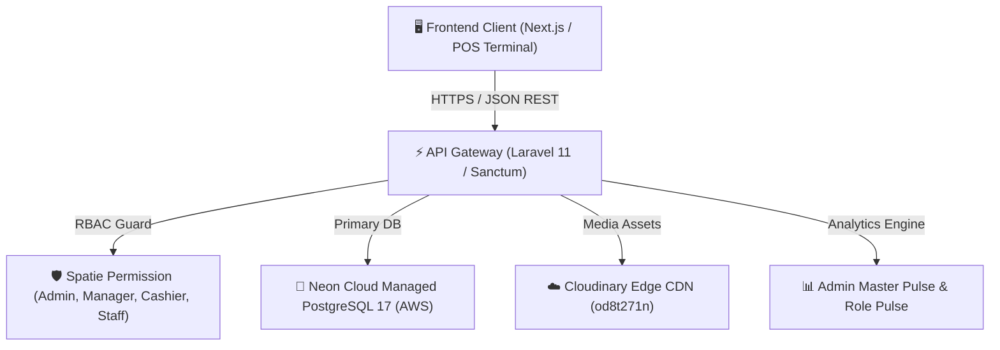
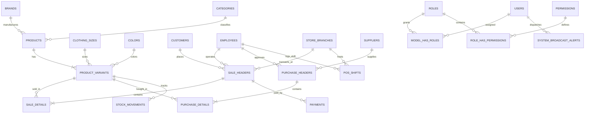

# KhmeRiel MIS & POS — Enterprise Backend Web API

> **System Name**: KhmeRiel Store Stock & Point-of-Sale Information System  
> **Production API**: `https://api.kesararamwithdigital.tech/api/v1`  
> **Local API**: `http://127.0.0.1:8000/api/v1`  
> **Frontend App**: `https://app.kesararamwithdigital.tech`  
> **Repository**: [`SNPbuilds/csms-backend-api`](https://github.com/SNPbuilds/csms-backend-api)  
> **Default Tax**: `10.00% Tax-Exclusive (VAT)`

---

## 1. Documentation Index

- 📋 **[Product Catalog & Variant Matrix](file:///Users/Apple16/Desktop/SS_MIS/PRODUCT_CATALOG_DATA_DOCUMENT.md)**: Full breakdown of all 10 products, 26 variants, SKUs, barcodes, pricing, and 2D stock matrices.
- 🔐 **[Frontend API Service & RBAC Guide](file:///Users/Apple16/Desktop/SS_MIS/FRONTEND_API_SERVICE_RBAC_GUIDE.md)**: Frontend contract for Next.js client developers covering all 122 API routes and role guards.
- ⚡ **[Postman Collection & Quickstart](file:///Users/Apple16/Desktop/SS_MIS/postman/README.md)**: Ready-to-import Postman v2.1.0 collection with pre-filled bearer tokens.
- 🧠 **[Master API Skill Guide](file:///Users/Apple16/Desktop/SS_MIS/.agents/skills/ssmis-api-master-guide/SKILL.md)**: Architecture design rules and mathematical tax formulations.

---

## 2. System Architecture & Tech Stack



- **Framework**: Laravel 11 / PHP 8.3 & 8.5
- **Primary Database**: PostgreSQL 17 on Neon Serverless Cloud (`neondb` on AWS us-east-1)
- **Media CDN**: Cloudinary Edge Delivery (`https://res.cloudinary.com/od8t271n/image/upload/`)
- **Authentication**: Laravel Sanctum Bearer Tokens (Multi-guard)
- **Authorization**: Spatie Role-Based Access Control (RBAC)
- **Tax Model**: 10.00% Tax-Exclusive Standard VAT Formula

---

## 3. Comprehensive Database Entity Architecture



---

## 4. Master Data Entities & Schema Dictionary

### 4.1 Master Catalog Entities
| Table Name | Primary Key | Foreign Keys | Key Attributes | Purpose |
| :--- | :---: | :--- | :--- | :--- |
| **`brands`** | `brand_id` | — | `brand_name`, `country_of_origin`, `description` | 5 verified fashion and beverage brands |
| **`categories`** | `category_id` | `parent_id` | `category_name`, `department_type`, `description` | 9 departments (Tops, Dresses, Beer...) |
| **`clothing_sizes`** | `size_id` | — | `size_name`, `description` | Luxury sizes (`S`, `M`, `L`, `XL`, `OS`) |
| **`colors`** | `color_id` | — | `color_name`, `description` | Luxury palette (`Black`, `White`, `Gold`) |
| **`products`** | `product_id` | `brand_id`, `category_id` | `product_name`, `gender`, `material_fabric`, `image_url` | 10 master product styles |
| **`product_variants`** | `variant_id` | `product_id`, `size_id`, `color_id` | `sku`, `barcode`, `cost_price`, `sale_price`, `quantity`, `volume_or_weight`, `alcohol_by_volume` | 26 active sellable item combinations |
| **`product_images`** | `image_id` | `product_id` | `image_url`, `is_primary`, `sort_order` | Multi-shot high-res product photos |

### 4.2 Point-of-Sale & Financial Entities
| Table Name | Primary Key | Foreign Keys | Key Attributes | Purpose |
| :--- | :---: | :--- | :--- | :--- |
| **`sale_headers`** | `sale_id` | `customer_id`, `employee_id`, `branch_id` | `sale_date`, `total_amount`, `discount`, `tax_rate`, `tax_amount`, `grand_total`, `status` | Header invoice record with 10% VAT |
| **`sale_details`** | `detail_id` | `sale_id`, `variant_id` | `quantity`, `unit_price`, `discount`, `subtotal` | Stamped historical sales lines |
| **`payments`** | `payment_id` | `sale_id` | `payment_method`, `amount_paid`, `reference_number` | Tender ledger (Cash, ABA, Card, KHQR) |
| **`pos_shifts`** | `shift_id` | `employee_id`, `branch_id` | `opened_at`, `closed_at`, `opening_float_usd`, `closing_cash_usd`, `status`, `z_report_summary` | Cash drawer register tracking |

### 4.3 Supply Chain & Inventory Entities
| Table Name | Primary Key | Foreign Keys | Key Attributes | Purpose |
| :--- | :---: | :--- | :--- | :--- |
| **`suppliers`** | `supplier_id` | — | `supplier_name`, `phone`, `email`, `address` | Master supplier and factory contacts |
| **`purchase_headers`**| `purchase_id`| `supplier_id`, `employee_id` | `purchase_date`, `total_amount`, `status` | Purchase orders sent to suppliers |
| **`purchase_details`**| `detail_id` | `purchase_id`, `variant_id` | `quantity_ordered`, `quantity_received`, `cost_price`, `subtotal` | Stamped PO lines |
| **`stock_movements`** | `movement_id`| `variant_id`, `employee_id` | `movement_type`, `quantity`, `reference_type`, `reference_id` | Immutable inventory deduction audit trail |

### 4.4 Enterprise RBAC & Security Entities
| Table Name | Primary Key | Foreign Keys | Key Attributes | Purpose |
| :--- | :---: | :--- | :--- | :--- |
| **`users`** | `id` | — | `name`, `email`, `password`, `created_at` | Authenticated portal user accounts |
| **`employees`** | `employee_id` | `branch_id`, `user_id` | `employee_name`, `phone`, `email`, `position`, `role` | Staff and employee personnel directory |
| **`store_branches`** | `branch_id` | — | `branch_name`, `branch_code`, `address`, `phone` | Retail store and warehouse locations |
| **`roles`** | `id` | — | `name`, `guard_name` | Spatie RBAC Roles (`admin`, `manager`, `cashier`, `staff`) |
| **`permissions`** | `id` | — | `name`, `guard_name` | 42 granular system permissions |
| **`system_broadcast_alerts`**| `alert_id`| `created_by_user_id`| `title`, `message`, `priority`, `target_role`, `is_active` | Real-time broadcast alerts & reminders |
| **`audit_logs`** | `audit_id` | `user_id` | `action`, `model_type`, `model_id`, `ip_address`, `changes_payload` | Immutable security audit trail |

---

## 5. Role-Based Access Control (4 Levels)

```
┌─────────────────┬──────────┬───────────────────────────────┬───────────────────────────────────────┐
│ User Role       │ Level    │ Primary Interface             │ Permissions Scope                     │
├─────────────────┼──────────┼───────────────────────────────┼───────────────────────────────────────┤
│ 🌐 PUBLIC       │ Level 1  │ Luxury Storefront Catalog     │ Read-only products, categories, matrix│
│ 💳 CASHIER      │ Level 2  │ POS Touch Register & Scanner  │ Checkout, receipt, KHQR, open shift   │
│ 📦 STAFF        │ Level 2  │ Showroom & Floor Lookup       │ Barcode scan, stock lookup, low-stock │
│ 👔 MANAGER      │ Level 3  │ Store Management & Inventory  │ CRUD products/variants, void, POs     │
│ 👑 ADMIN        │ Level 4  │ Master Command & Security     │ Full system CRUD, staff timesheets,   │
│                 │          │                               │ financial waterfall, broadcast alerts │
└─────────────────┴──────────┴───────────────────────────────┴───────────────────────────────────────┘
```

---

## 6. Financial VAT Formula (10% Tax-Exclusive)

$$\text{Net Amount} = \text{Total Amount} - \text{Overall Discount}$$
$$\text{Tax Amount (10\% VAT)} = \text{Round}\left(\text{Net Amount} \times 0.10, 2\right)$$
$$\text{Grand Total Payable} = \text{Net Amount} + \text{Tax Amount}$$

*Example: Selling 1 Silk Shirt ($65.00) $\to$ Net = $65.00 $\to$ 10% VAT = $6.50 $\to$ Grand Total = **$71.50**.*

---

## 7. Quickstart & Local Setup

```bash
# 1. Clone the repository
git clone https://github.com/SNPbuilds/csms-backend-api.git
cd csms-backend-api

# 2. Install PHP dependencies
composer install

# 3. Configure environment
cp .env.example .env

# 4. Start local development server
php artisan serve --host=127.0.0.1 --port=8000
```

- API Base: `http://127.0.0.1:8000/api/v1`
- Postman Collection: [`postman/khmeriel_ssmis_postman_collection.json`](file:///Users/Apple16/Desktop/SS_MIS/postman/khmeriel_ssmis_postman_collection.json)
