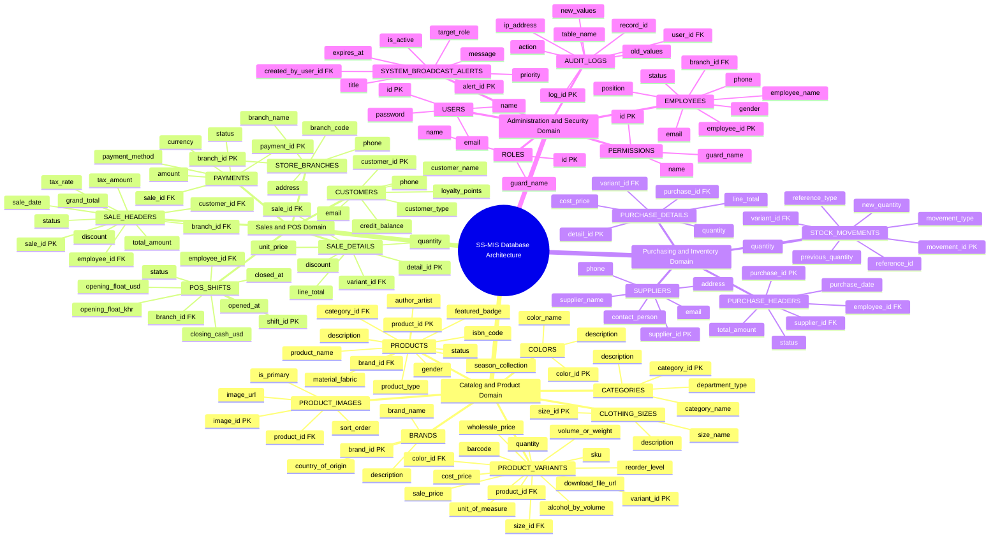

# Store Stock and Point-of-Sale Information System (SS-MIS) API

RESTful API backend for retail clothing store inventory, supplier purchasing, POS checkout, and role-based administrative control.

---

## 1. System Classification

IS Type: Transaction Processing System (TPS / OLTP) with embedded Management Information System (MIS) Reporting  
Architecture: Monolithic, Headless REST API Backend  
Access Model: 4-Tier Role-Based Access Control (Admin, Manager, Cashier, Staff)

SS-MIS processes routine retail transactions in real-time (POS checkout, stock deduction, purchase receiving) qualifying it as a TPS/OLTP system. It also exposes structured management analytics (staff timesheets, financial waterfall, low-stock forecasts, audit logs), functioning as an MIS control layer.

---

## 2. Complete Database Entity Mindmap Diagram

---

## 3. Entity Domain Breakdown

### 3.1 Catalog and Product Domain
The foundation of merchandise categorization, luxury sizing, color palettes, and stockable Stock Keeping Units (SKUs).

- Categories: Organizes physical apparel and FMCG merchandise into Tops, Dresses, Pants, Jackets, Skirts, Polos, Bags, Shoes, and Beer.
- Brands: Tracks manufacturers and luxury fashion labels.
- Products: Master item records holding high-level product descriptions, fabric composition, and season collections.
- Clothing Sizes: Standardized luxury apparel sizes (S, M, L, XL, OS).
- Colors: Luxury palette definitions with hex color representations (Black, White, Gold).
- Product Variants: Atomic matrix intersections of Product, Size, and Color holding exact inventory counts, costs, retail prices, and barcodes.
- Product Images: CDN photo gallery records associated with product headers.

### 3.2 Sales and Point-of-Sale Domain
Manages real-time cash register shifts, retail transactions, customer loyalty balances, and payment processing.

- Store Branches: Retail store and warehouse facility records.
- Customers: Walk-in and registered VIP clientele tracking accumulated loyalty points and credit accounts.
- POS Shifts: Daily cash drawer reconciliation, opening cash float, safe drops, and closing Z-reports.
- Sale Headers: Immutable financial invoice master records calculating Net Amount, 10 percent VAT Tax Amount, and Grand Total.
- Sale Details: Individual line items preserving the historical unit sale price at the exact second of checkout.
- Payments: Multi-tender payment transactions (Cash USD, Cash KHR, ABA KHQR, Card).

### 3.3 Purchasing and Inventory Domain
Controls warehouse replenishment, vendor purchase orders, and stock audit ledgers.

- Suppliers: Master records of fabric mills, apparel distributors, and beverage suppliers.
- Purchase Headers and Details: Procurement transactions tracking cost prices, order quantities, and delivery statuses.
- Stock Movements: Append-only audit ledger tracking every stock addition (Purchase Receipt, Adjustment In) and deduction (POS Sale, Adjustment Out).

### 3.4 Administration and Security Domain
Manages role-based authentication, staff timesheets, emergency broadcast announcements, and audit inspection.

- Users, Roles, and Permissions: Granular access control defining permissions across 4 user hierarchy levels.
- Employees: Staff profiles assigned to specific store branches and job positions.
- System Broadcast Alerts: Real-time broadcast messages dispatched by Admin to all users or specific roles.
- Audit Logs: Immutable system activity trail recording payload changes, timestamps, and IP addresses.

---

## 4. Tax Calculation Standard

The system enforces a 10.00 percent Tax-Exclusive Value Added Tax (VAT) formula:

1. Net Amount = Total Amount - Overall Discount
2. Tax Amount (10 percent VAT) = Round(Net Amount * 0.10, 2)
3. Grand Total = Net Amount + Tax Amount

Historical Unit Price Rule: Unit prices stored in Sale Details are stamped permanently at checkout from Product Variants and are never modified by subsequent price changes in the product catalog.
