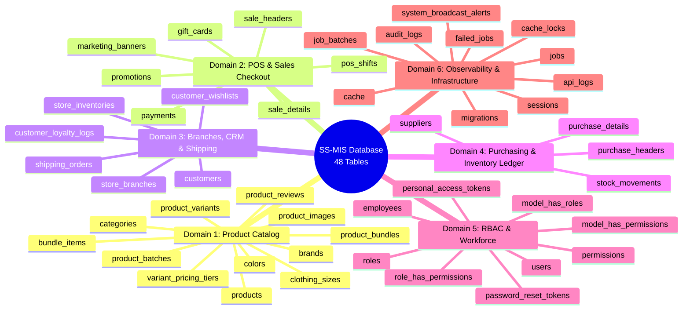
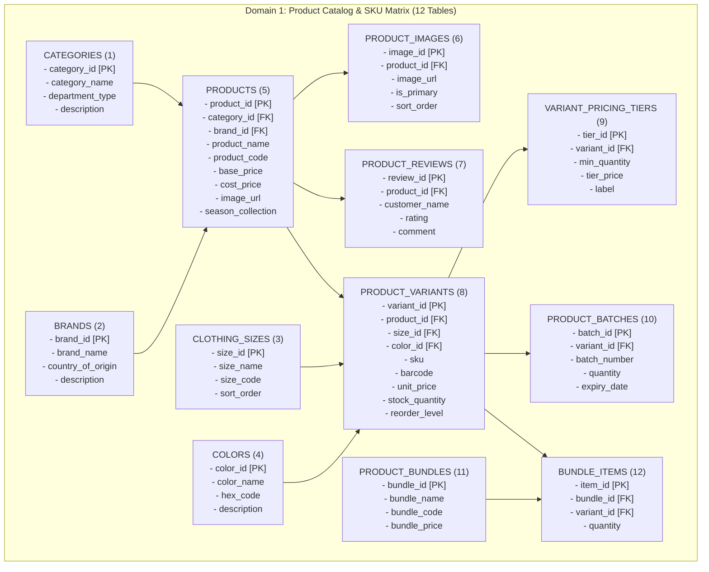
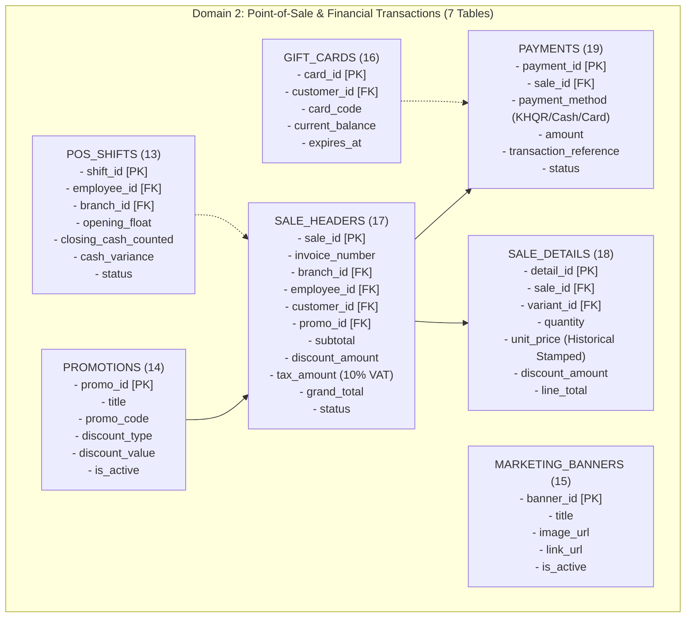
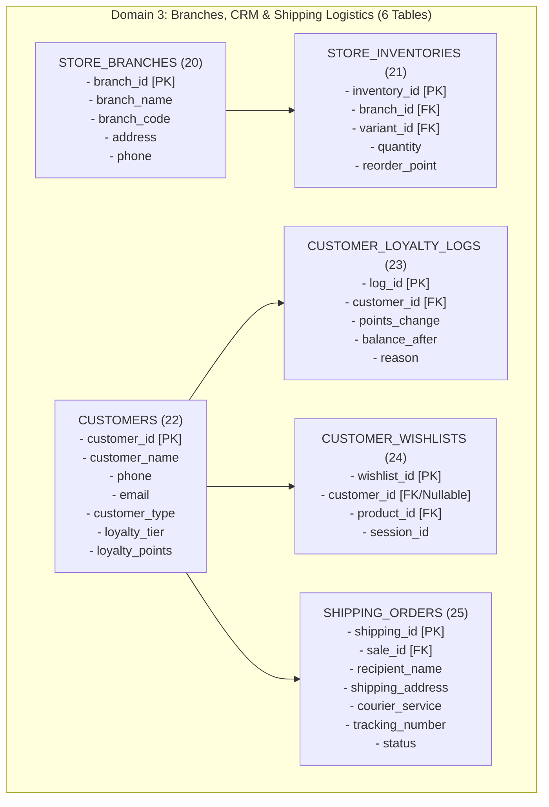
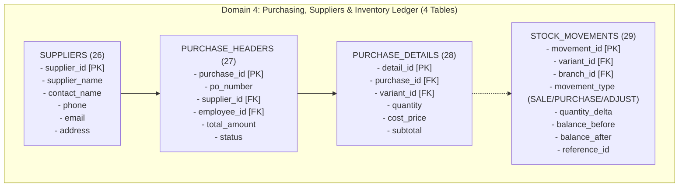
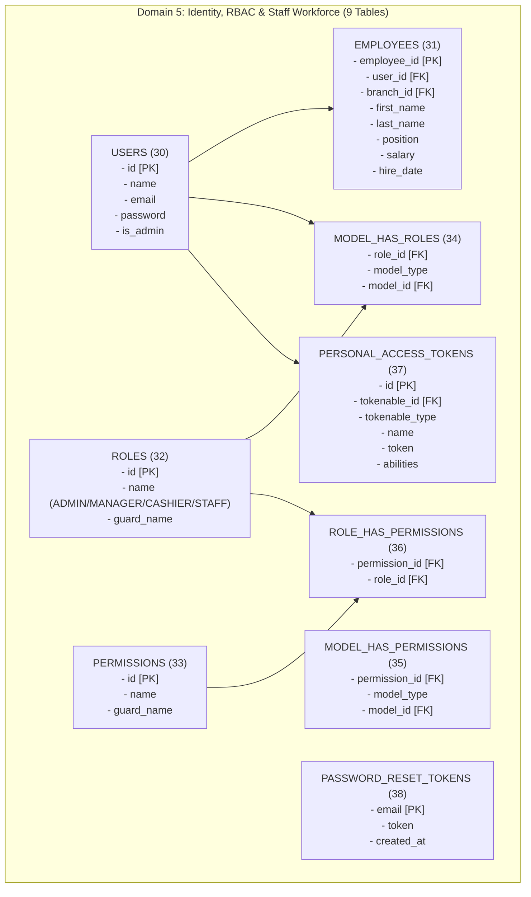
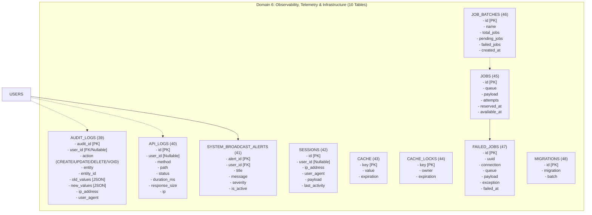

# Store Stock and Point-of-Sale Information System (SS-MIS) API

RESTful API backend for retail clothing store inventory, supplier purchasing, POS checkout, omnichannel logistics, and role-based administrative control.

---

## 1. System Classification

* **IS Type**: Transaction Processing System (TPS / OLTP) with embedded Management Information System (MIS) Reporting  
* **Architecture**: Monolithic, Headless REST API Backend (Laravel 11 + PostgreSQL 16)
* **Access Model**: 4-Tier Role-Based Access Control (`ADMIN`, `MANAGER`, `CASHIER`, `STAFF`)
* **Total Database Entities**: 48 Tables across 6 Core Operational Domains

---

## 2. Complete Database Entity Mindmap Diagrams (All 48 Tables)

### 2.0 Master Database Architecture Overview (All 6 Domains)

---

### 2.1 Domain 1: Product Catalog & Luxury Apparel Merchandise (12 Tables)

---

### 2.2 Domain 2: Point-of-Sale (POS), Cash Register & Financial Transactions (7 Tables)

---

### 2.3 Domain 3: Omnichannel Branches, Logistics & Customer CRM (6 Tables)

---

### 2.4 Domain 4: Purchasing, Suppliers & Stock Movement Ledger (4 Tables)

---

### 2.5 Domain 5: Identity, Spatie RBAC & Staff Workforce (9 Tables)

---

### 2.6 Domain 6: Observability, Telemetry & Infrastructure Queues (10 Tables)

---

## 3. Comprehensive 48-Table Reference Matrix

| # | Table Name | Primary Key | Key Foreign Keys | Primary Function |
| :--- | :--- | :--- | :--- | :--- |
| **1** | `categories` | `category_id` | — | Product classification hierarchy & department tagging |
| **2** | `brands` | `brand_id` | — | Fashion labels, manufacturer origins & brand descriptions |
| **3** | `clothing_sizes` | `size_id` | — | Standardized size codes (S, M, L, XL, XXL, OS) & sort orders |
| **4** | `colors` | `color_id` | — | Color palettes & CSS hex codes for UI colorways |
| **5** | `products` | `product_id` | `category_id`, `brand_id` | Master catalog header holding base price and product descriptors |
| **6** | `product_variants` | `variant_id` | `product_id`, `size_id`, `color_id` | Atomic SKU matrix intersection holding unit price & barcode |
| **7** | `product_images` | `image_id` | `product_id` | Cloudinary CDN multi-image product gallery |
| **8** | `variant_pricing_tiers` | `tier_id` | `variant_id` | Wholesale volume pricing discounts (10+ pcs, 50+ pcs) |
| **9** | `product_batches` | `batch_id` | `variant_id` | FMCG FIFO inventory batches with manufacture & expiry dates |
| **10** | `product_reviews` | `review_id` | `product_id` | Customer ratings (1-5 stars) and qualitative feedback |
| **11** | `product_bundles` | `bundle_id` | — | Combo package definitions & gift set headers |
| **12** | `bundle_items` | `item_id` | `bundle_id`, `variant_id` | Line items and quantities comprising a bundle package |
| **13** | `pos_shifts` | `shift_id` | `employee_id`, `branch_id` | Cash register float sessions, drops & closing Z-reports |
| **14** | `promotions` | `promo_id` | — | Promotional coupon campaigns, discounts, and flash sales |
| **15** | `marketing_banners` | `banner_id` | — | Storefront hero carousel banners & seasonal promotions |
| **16** | `gift_cards` | `card_id` | `customer_id` | Digital stored-value gift cards & balance verification |
| **17** | `sale_headers` | `sale_id` | `branch_id`, `employee_id`, `customer_id` | Immutable financial sales invoice (10% VAT tax-exclusive) |
| **18** | `sale_details` | `detail_id` | `sale_id`, `variant_id` | Stamped line item record preserving historical price at sale |
| **19** | `payments` | `payment_id` | `sale_id` | Multi-tender payment records (Cash USD, ABA KHQR, Card) |
| **20** | `store_branches` | `branch_id` | — | Physical retail stores, flagships, and warehouse outlets |
| **21** | `store_inventories` | `inventory_id` | `branch_id`, `variant_id` | Isolated stock quantities segregated per physical branch |
| **22** | `customers` | `customer_id` | — | Client profile directory, loyalty tiers & phone search index |
| **23** | `customer_loyalty_logs` | `log_id` | `customer_id` | Ledger tracking loyalty point accrual and redemptions |
| **24** | `customer_wishlists` | `wishlist_id` | `product_id`, `customer_id` | Saved favorites for registered users and guest sessions |
| **25** | `shipping_orders` | `shipping_id` | `sale_id` | Delivery tracking, courier dispatches, and click-and-collect |
| **26** | `suppliers` | `supplier_id` | — | Wholesale vendor profiles, lead times, and contact information |
| **27** | `purchase_headers` | `purchase_id` | `supplier_id`, `employee_id` | Vendor procurement orders and inbound receiving receipts |
| **28** | `purchase_details` | `detail_id` | `purchase_id`, `variant_id` | Inbound items, negotiated unit cost prices & quantities |
| **29** | `stock_movements` | `movement_id` | `variant_id`, `branch_id` | Immutable audit log of all stock increases & deductions |
| **30** | `users` | `id` | — | System authentication accounts with bcrypt passwords |
| **31** | `employees` | `employee_id` | `user_id`, `branch_id` | Staff HR records, positions, salaries, and branch assignments |
| **32** | `roles` | `id` | — | Spatie RBAC security roles (`ADMIN`, `MANAGER`, `CASHIER`) |
| **33** | `permissions` | `id` | — | Fine-grained API endpoint security capabilities |
| **34** | `model_has_roles` | Composite | `role_id`, `model_id` | Polymorphic relationship assigning roles to users/staff |
| **35** | `model_has_permissions` | Composite | `permission_id`, `model_id` | Direct permission overrides for individual users |
| **36** | `role_has_permissions` | Composite | `permission_id`, `role_id` | Matrix linking permissions to predefined RBAC roles |
| **37** | `personal_access_tokens`| `id` | `tokenable_id` | Laravel Sanctum SHA-256 hashed Bearer API tokens |
| **38** | `password_reset_tokens` | `email` | — | One-time recovery tokens for user password resets |
| **39** | `audit_logs` | `audit_id` | `user_id` | Immutable JSON diffs (`old_values`, `new_values`) & IP audit |
| **40** | `api_logs` | `id` | `user_id` | HTTP request telemetry: latency (ms), status, payload size |
| **41** | `system_broadcast_alerts`| `alert_id` | `user_id` | Push broadcast notification banner messages to active staff |
| **42** | `sessions` | `id` | `user_id` | Web session state payloads and active user tracking |
| **43** | `cache` | `key` | — | High-performance application caching store |
| **44** | `cache_locks` | `key` | — | Atomic locking mechanisms for concurrent transactions |
| **45** | `jobs` | `id` | — | Asynchronous background processing queue |
| **46** | `job_batches` | `id` | — | Distributed queue batch monitoring & execution tracking |
| **47** | `failed_jobs` | `id` | — | Dead-letter queue capturing unhandled async exceptions |
| **48** | `migrations` | `id` | — | Database schema version history and migration audit log |

---

## 4. Tax Calculation Standard

The system enforces a **10.00% Tax-Exclusive Value Added Tax (VAT)** formula:

$$\text{Net Amount} = \text{Subtotal} - \text{Discount Amount}$$

$$\text{Tax Amount (10\% VAT)} = \text{Round}(\text{Net Amount} \times 0.10, 2)$$

$$\text{Grand Total} = \text{Net Amount} + \text{Tax Amount}$$

> [!IMPORTANT]
> **Historical Unit Price Rule**: Unit prices in `sale_details` are permanently stamped at the moment of checkout and are never altered by subsequent updates to product catalog master prices.
