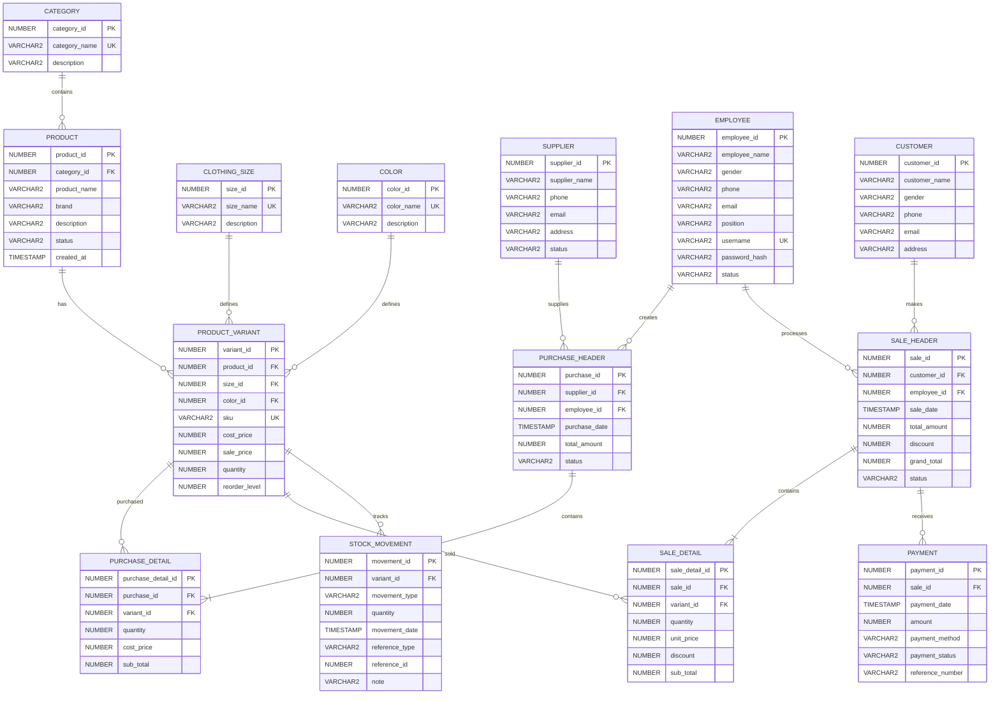

# SS-MIS Database Schema & Entity-Relationship (ER) Diagram

Authoritative reference for the database tables, fields, constraints, and relationships for the Store Stock & Point-of-Sale Information System (SS-MIS).

## Mermaid Entity-Relationship Diagram

