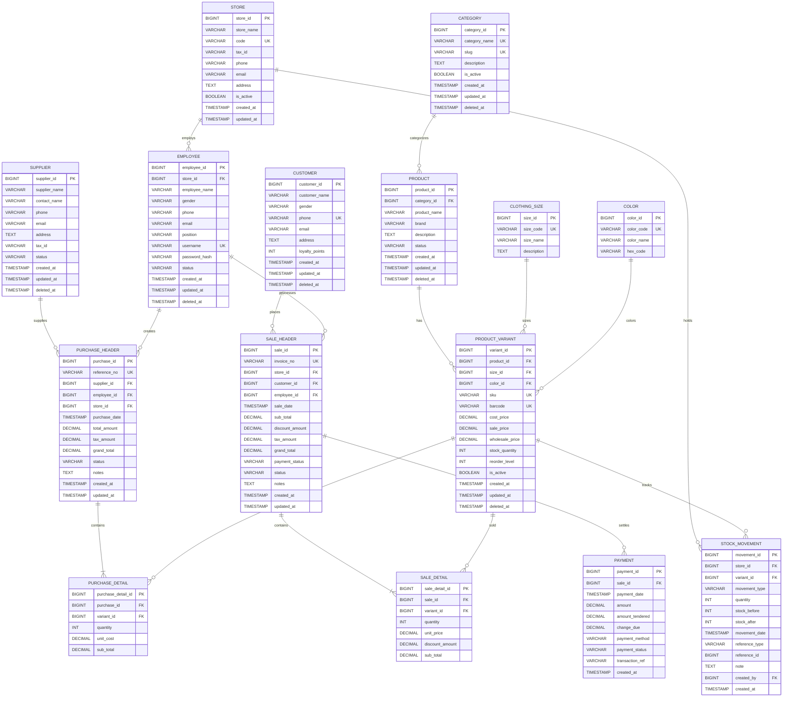

# SS-MIS Database Schema & Entity-Relationship (ER) Diagram (Standard Enterprise SQL)

Authoritative reference for the database tables, data types, constraints, and relationships for the Store Stock & Point-of-Sale Information System (SS-MIS).

Designed according to **worldwide enterprise SQL standards**, incorporating:
- Standard ANSI SQL types (`DECIMAL(12,2)`, `BIGINT`, `VARCHAR`, `TIMESTAMPTZ`, `BOOLEAN`).
- Financial accuracy for POS transactions using exact fixed-point decimal arithmetic.
- Soft delete support (`deleted_at`) for audit compliance and historical integrity.
- Multi-store / multi-branch readiness (`store_id`).
- Barcode / EAN scanner integration (`barcode`).
- Comprehensive audit timestamps (`created_at`, `updated_at`, `deleted_at`).
- Detailed stock movements with pre/post balance audit trail (`stock_before`, `stock_after`).

## Entity-Relationship Diagram (Mermaid)

## Professional Database Design Highlights

| Domain Feature | Worldwide Standard Practice | Implementation in SS-MIS |
|---|---|---|
| **Monetary Values** | Fixed-point `DECIMAL(12,2)` | Prevents IEEE 754 floating point rounding errors in cash registers & receipts |
| **Audit Trails** | Timestamps & Audit Log | `created_at`, `updated_at`, `deleted_at` on all main entities |
| **Barcode Scanning** | Global EAN/UPC Code Indexing | `barcode` UNIQUE column on `PRODUCT_VARIANT` for instant POS optical scanner lookup |
| **Stock Integrity** | Balance Tracking | `stock_before` and `stock_after` on `STOCK_MOVEMENT` for immutable inventory audit logs |
| **Soft Deletes** | Regulatory Compliance | Soft deletes on Products, Customers, Employees, and Suppliers to preserve historical sales reports |
| **Multi-Store Scaling**| Multi-tenant / Multi-location | `store_id` foreign keys allow effortless expansion from single shop to multi-branch chains |
